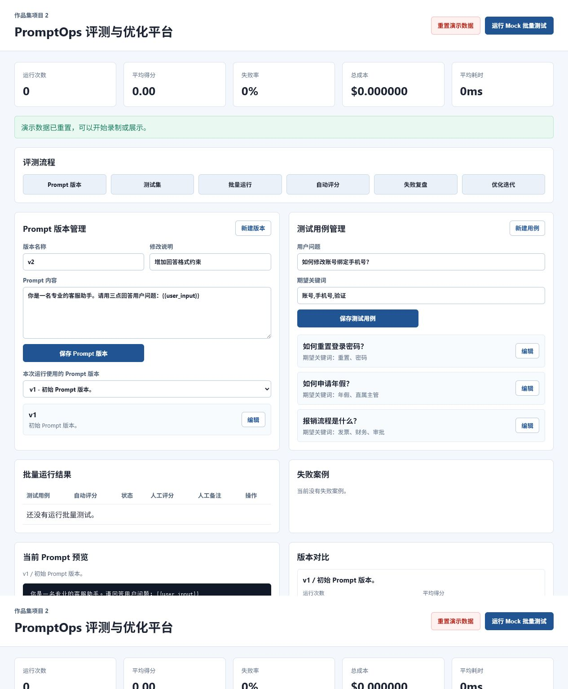
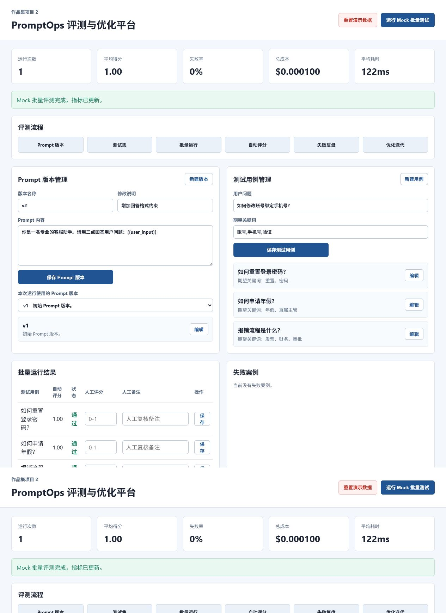
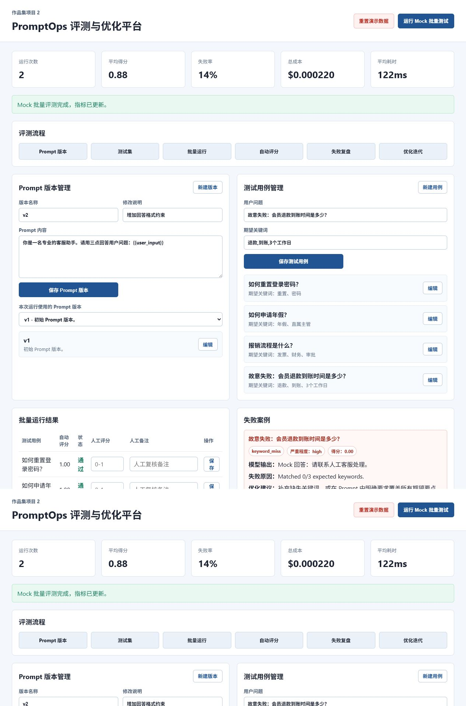

# PromptOps 评测与 Prompt 优化平台

这是一个面向 Prompt 工程师、AI Agent 效果优化、AI 产品研发岗位的作品集项目。

项目核心不是“调用一次大模型”，而是把 Prompt 当成可以测试、评分、复盘、对比和持续优化的工程资产来管理。

## 项目价值

很多 AI Demo 只展示一次成功回答，但真实工作里更重要的是：

```text
Prompt 版本 -> 测试集 -> 批量运行 -> 模型输出 -> 自动评分 -> 人工复核 -> 失败分析 -> Prompt 优化
```

这个项目展示的是 Prompt 工程化能力：如何管理版本、如何批量评测、如何发现失败案例、如何证明新 Prompt 是否真的更好。

## 核心功能

- Prompt 版本管理：新增、编辑、选择不同 Prompt 版本运行评测。
- 测试用例管理：新增、编辑测试问题和期望关键词。
- Mock 模型模式：无 API Key 也能完整演示。
- 批量运行测试：一键用指定 Prompt 跑完整测试集。
- 自动评分：基于期望关键词命中率计算得分和通过状态。
- 人工评分：对每条模型输出补充人工分数和复核备注。
- 失败案例分析：记录失败问题、模型输出、严重程度、失败原因和优化建议。
- Prompt 版本对比：基于真实历史运行记录统计平均分、失败率、成本和耗时。
- 成本和耗时统计：展示总成本、平均耗时等运行指标。
- 一键重置演示数据：方便录屏、面试和 HR 展示。

## 技术栈

- 后端：Python、FastAPI
- 数据库：SQLite
- 前端：HTML、CSS、JavaScript
- 测试：Python `unittest`
- 模型模式：Mock first，后续可扩展 OpenAI / Claude / Gemini / DeepSeek

## 项目结构

```text
backend/
  app/
    core/models.py
    db/repository.py
    services/
    main.py
  tests/
frontend/
  index.html
  styles.css
  app.js
docs/
  architecture.md
  architecture_diagram.md
  demo_script.md
  final_checklist.md
  interview_guide.md
  resume_project.md
  screenshots/
```

## 本地运行

安装依赖：

```powershell
pip install -r backend\requirements.txt
```

运行测试：

```powershell
python -m unittest discover backend\tests -v
```

启动服务：

```powershell
python -m uvicorn backend.app.main:app --reload
```

如果 `8000` 端口被占用：

```powershell
python -m uvicorn backend.app.main:app --reload --port 8001
```

打开页面：

```text
http://127.0.0.1:8000/
```

或：

```text
http://127.0.0.1:8001/
```

## 推荐演示流程

1. 点击 `重置演示数据`，恢复干净演示状态。
2. 展示仪表盘指标：运行次数、平均得分、失败率、成本、耗时。
3. 展示 Prompt 版本管理，说明 Prompt 像代码一样需要版本管理。
4. 展示测试用例管理，说明测试集用来验证 Prompt 是否稳定。
5. 点击 `运行 Mock 批量测试`，查看自动评分结果。
6. 对一条输出填写人工评分和复核备注。
7. 新增一个以 `故意失败` 开头的测试用例，触发失败分析。
8. 查看失败案例卡片，解释失败原因和优化建议。
9. 查看版本对比，说明如何证明 Prompt 版本是否变好。

## 功能截图

### 1. 重置后的仪表盘



### 2. 批量运行结果



### 3. 失败案例分析


### 4. Prompt 版本对比



## API 概览

| Method | Path | 用途 |
| --- | --- | --- |
| GET | `/api/health` | 健康检查 |
| GET | `/api/dashboard` | 仪表盘指标 |
| GET | `/api/prompt-versions` | Prompt 版本列表 |
| POST | `/api/prompt-versions` | 新增 Prompt 版本 |
| PUT | `/api/prompt-versions/{version_id}` | 编辑 Prompt 版本 |
| GET | `/api/test-cases` | 测试用例列表 |
| POST | `/api/test-cases` | 新增测试用例 |
| PUT | `/api/test-cases/{case_id}` | 编辑测试用例 |
| POST | `/api/runs/mock` | 批量运行 Mock 测试 |
| PUT | `/api/model-outputs/{output_id}/human-review` | 保存人工评分 |
| GET | `/api/failure-cases` | 失败案例分析 |
| GET | `/api/prompt-version-comparison` | Prompt 版本对比 |
| POST | `/api/demo/reset` | 重置演示数据 |

## 作品集材料

- 架构说明：[docs/architecture.md](docs/architecture.md)
- 架构图：[docs/architecture_diagram.md](docs/architecture_diagram.md)
- 演示视频脚本：[docs/demo_script.md](docs/demo_script.md)
- 简历项目描述：[docs/resume_project.md](docs/resume_project.md)
- 面试讲解稿：[docs/interview_guide.md](docs/interview_guide.md)
- 最终检查清单：[docs/final_checklist.md](docs/final_checklist.md)
- 作品集交付包：[docs/portfolio_package.md](docs/portfolio_package.md)
- 截图说明：[docs/screenshots/README.md](docs/screenshots/README.md)

## 当前测试结果

```text
python -m unittest discover backend\tests -v
Ran 16 tests
OK
```
