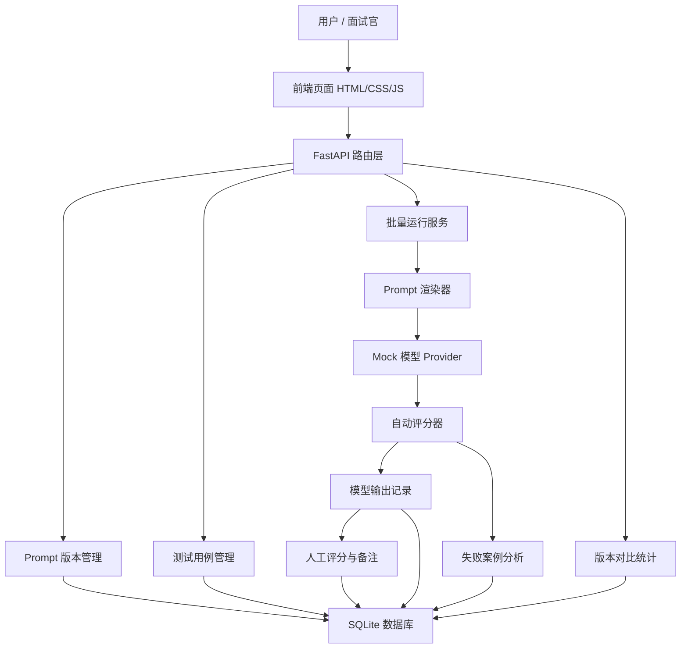
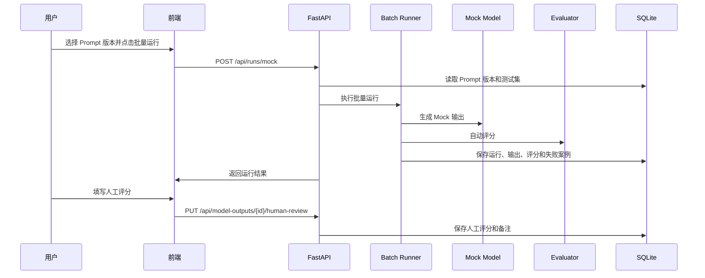

# 架构图

## 系统链路

```mermaid
flowchart TD
    A["用户 / 面试官"] --> B["前端页面 HTML/CSS/JS"]
    B --> C["FastAPI 路由层"]
    C --> D["Prompt 版本管理"]
    C --> E["测试用例管理"]
    C --> F["批量运行服务"]
    F --> G["Prompt 渲染器"]
    G --> H["Mock 模型 Provider"]
    H --> I["自动评分器"]
    I --> J["模型输出记录"]
    I --> K["失败案例分析"]
    J --> L["人工评分与备注"]
    C --> M["版本对比统计"]
    D --> N["SQLite 数据库"]
    E --> N
    J --> N
    K --> N
    L --> N
    M --> N
```

## 数据流

```mermaid
sequenceDiagram
    participant U as 用户
    participant UI as 前端
    participant API as FastAPI
    participant S as Batch Runner
    participant M as Mock Model
    participant E as Evaluator
    participant DB as SQLite

    U->>UI: 选择 Prompt 版本并点击批量运行
    UI->>API: POST /api/runs/mock
    API->>DB: 读取 Prompt 版本和测试集
    API->>S: 执行批量运行
    S->>M: 生成 Mock 输出
    S->>E: 自动评分
    S->>DB: 保存运行、输出、评分和失败案例
    API->>UI: 返回运行结果
    U->>UI: 填写人工评分
    UI->>API: PUT /api/model-outputs/{id}/human-review
    API->>DB: 保存人工评分和备注
```

